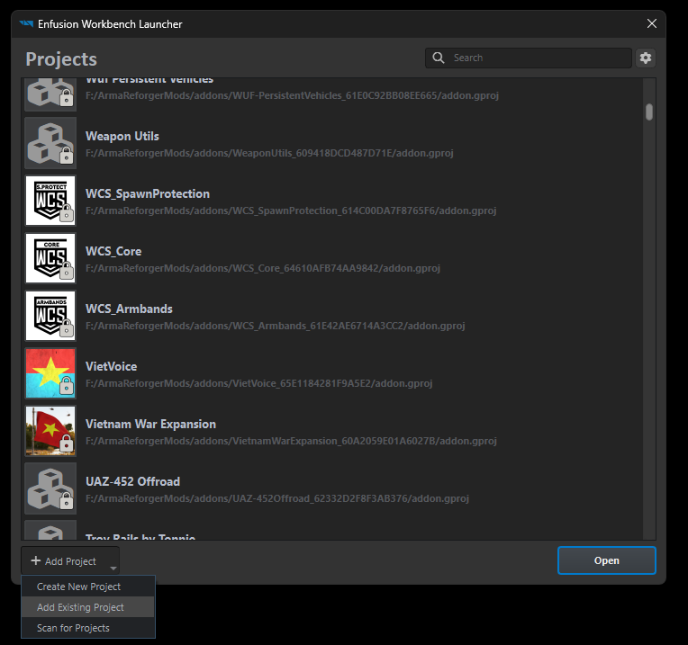
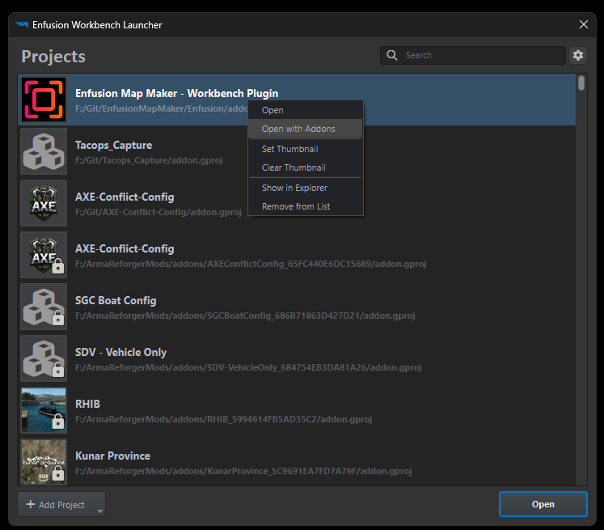
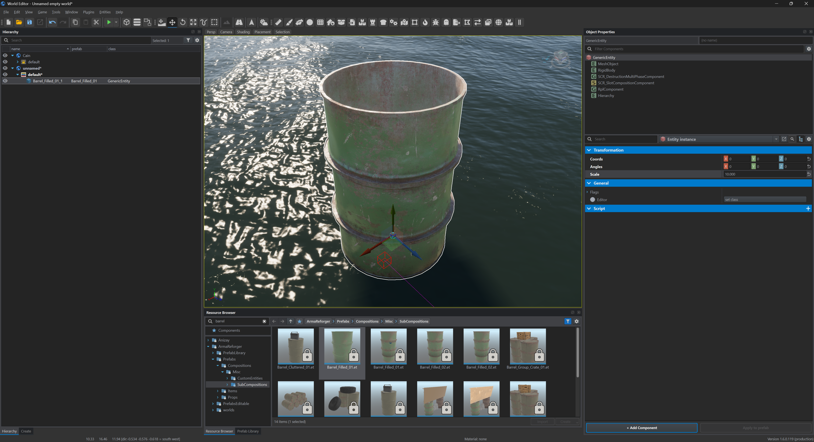
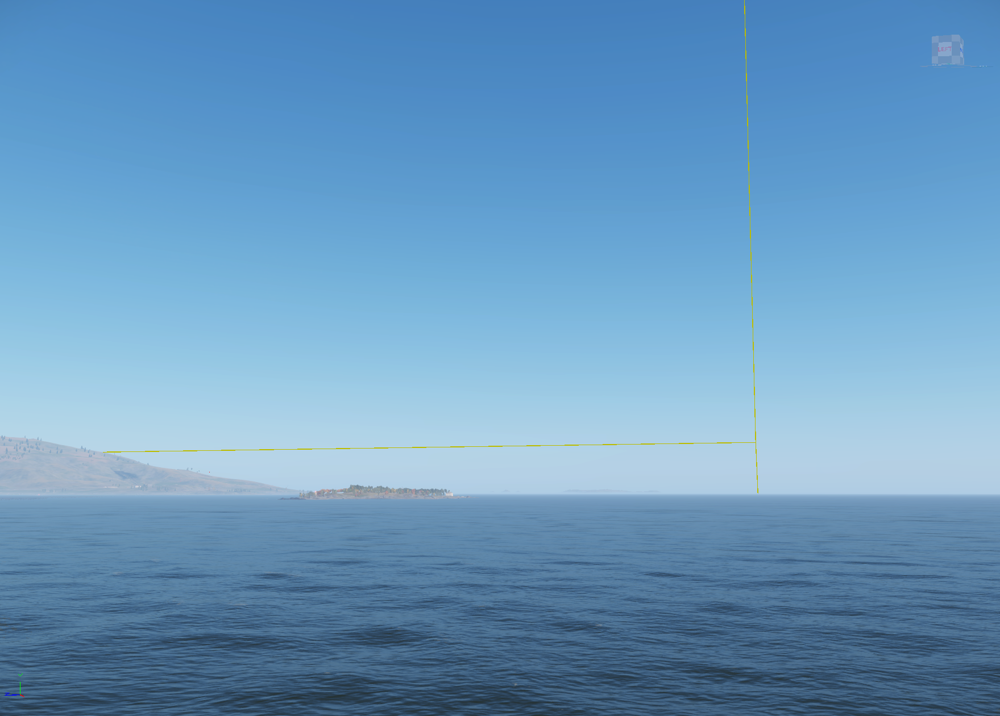
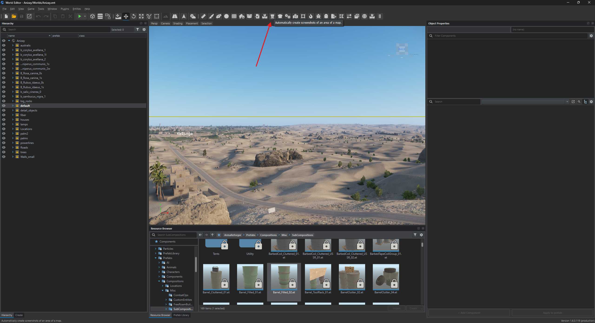
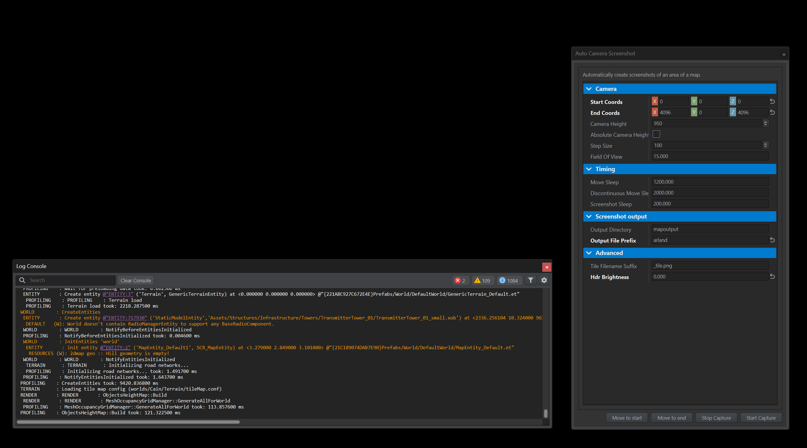
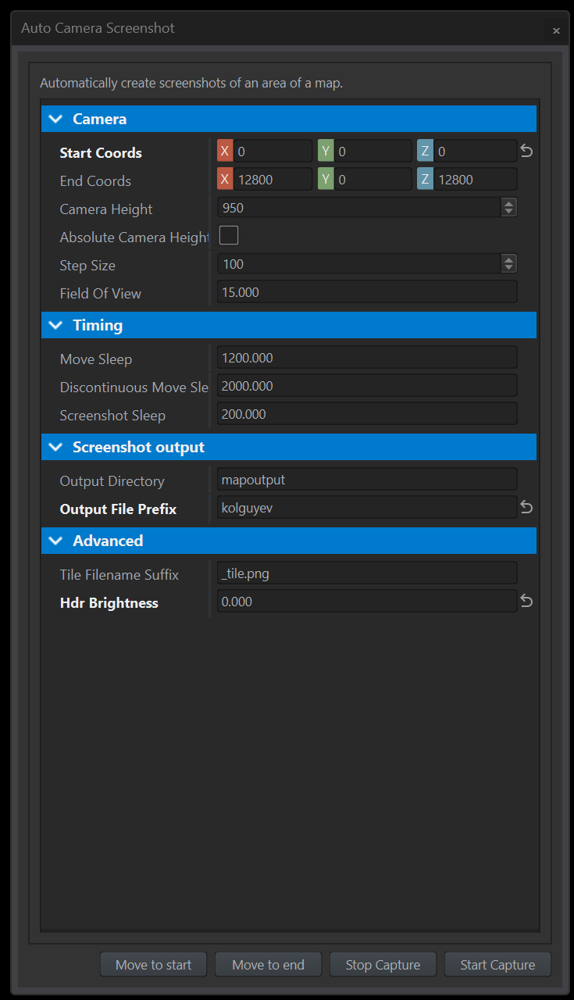
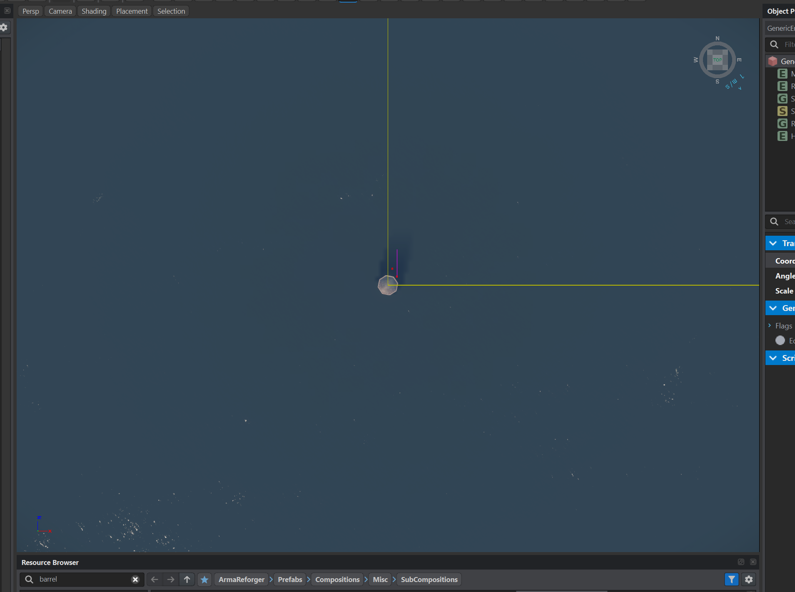

# TacOps Screen Capture Tools
Designed to streamline the processing and uploading of large screencapture sets.

Takes the output of the [Enfusion Map Maker](https://github.com/nickludlam/EnfusionMapMaker), converts the screen captures to .webp format and creates a zip archive that preserves the folder structure required for post processing.

Also provides an upload client to upload the zip archive to an AWS server and returns a URL for download of the archive valid for 7 days.

## AWS credentials
To store the AWS credentials locally use the AWS CLI to configure a credential file locally.
### OR
Manually add a config and credential file in `%USERPROFILE%\.aws\`

Config File contains:
```
[default]
region = eu-central-1
output = json
```
credentials file contains:
```
[default]
aws_access_key_id = *example access key*
aws_secret_access_key = *example access key secret*
```
## Enfusion Map Maker
The code to automate the screenshot capture can be downloaded from Nick Ludlam's Github repo [Enfusion Map Maker](https://github.com/nickludlam/EnfusionMapMaker).
This guide is a slightly modified version of Nick's own guide for his script to suit the workflow required to ingeast maps to the TacOps platform.

1) Either clone the repo or download it directly on your local machine somewhere that can be accessed by Arma Reforger Tools.

2) Open Open Reforger Tools and choose Add Project -> Add Exisitng Project


3) Navigate to the folder that you stored the Enfusion Map Marker files

4) Select the addon.gproj file in the enfusion folder

5) Now select the Enfusion Map Maker Project and right click -> Open with Addons


6) Select the mod of the map that you wish to capture

7) Once the project has loaded open the world editor and then open the world file that you want to capture

8) We're going to create some marker points for the start and and of the capture to aid pos processing.  Once your world has loaded create a new sub-scene to place the markers in.

9) Place a find the Barrel_Filled.et and place one in the world at coords 0,0,0 and set it's scale to 10. Press F to jump the camera to that location.


10) From there you can look around and you'll see the World Bounds defined as a yellow wireframe box.  You want to move the camera to the opposite corner from where the origin barrel is placed. If you can't see the yellow bounding box check that you have World Bounds enabled in the View menu. You can also select the GenericWorldEntity in the hirearchy check the Bounds Max to get the approximate location of the map, note that this can be slightly different to the terrain bounds that we care about.


11) Move the camera to the opposite corner of the map and place another barrel on the opposite corner of the world box.  The world bounds box *should* always be square so make sure your x and z values are identical for the barrel.

12) Now open up the the weather editor panel and make sure the weather is set to clear.  Experiment with the time of day to find a sweat spot of the shadows not being too long but also having some. Usually late morning or early afternoon is baout right but each terrain si different.

13) Load up the Map Maker tool by selecting the Castle icon in the tool bar and selecting "current tool" in the properties window


14) If you have a second monitor it's helpful to move the Auto Screenshot tool and Log Console to the other monitor


15) In the Auto Camera Screenshot window set:
- Start Coords to 0,0,0 (same as the origin barrel)
- End Coords to the same as the end barrel but round up to the next 100 to ensure the script runs properly.
- Camera Height = 950
-  Absolute Camera Height disabeld
- Step Size = 100
- Field of View = 15
- Move sleep, adjust this to ensure that your machine has rendered everything in frame before the screenhot is captured, I use 1200 (ms)
- Discontinuous move sleep, same as move sleep but for large moves, I use 2000 (ms)
- Screenshot sleep, delay after a screenshot is taken before moving, I use 200 (ms)
- Screenshot Output, mapoutput (can be changed but only changes the folder name not location)
- Output File prefix = map name, no spaces keep it short the post processing tools use this to name the archive as well
- Tile Filename suffix, _tile.png
HDR Brightness = 0.000


16) Now if you press the move to start and move to end buttons the camera should move to an exact top view of each barrel, lined up on the world bounds
**Note:** The camera field of view is changed by the window, this quite different from the standard FOV you are used to in the tools, it can make navigating around a bit tricky but it is important for the post processing toolset.


17) Before we start the capture we need to disable the gizmos and other things viewable in editor view. In the view menu disable:
- Visualisers
- Permanent Entity Visualisers
- World Bounds

18) Some maps also have slots for compositions to be placed in GM, like checkpoints on roads. Also hospitals, repair points and fueling stops will have large white cylinders viewable in the editor.  These all need to have their visibiliity turned off in the hirearchy panel.

19) Now press the move camera to start button

20) If you have a second screen then you can now press F11 to set the main world view to full screen and start the capture

21) If you don't have a second screen you'll need to start the capture and then set the view to full screen by pressing F11, you have 5 seconds to to do this after pressing start capture.

21) Once the capture has started you will see the camera move very couple of seconds, if you have a second screen you can see the progress in the log console window.

22) Once the capture is complete the log consonle will display finished an you can find all the captures in the `%USERPROFILE%\Documents\My Games\ArmaReforgerWorkbench\profile\mapoutput
folder.

23) Your now ready to use the compression and upload toolset.
